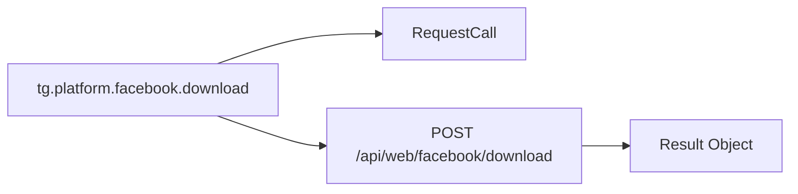

# Level architecture
Full documentation is available in [the docs](https://tgcore.ryzenths.dpdns.org/api/v2/docs).

Without explanation, the architecture may look confusing. ⊙⁠﹏⁠⊙



## Platform
parameters
- `url`
- tg.platform.`<method>`

```py
user = await tg.platform.facebook\
       .download()\
       .url()\
       .send(via_result=True)\

return user.video_url(0)
```

## Blackforest
* parameters
- `query`
```py
user = await tg.platform.blackforest\
      .image()\
      .query("HERE")\
      .send(via_result=True)\

return user.image_bytes()
```

## chatCompletions
* parameters
- `model`
- `messages`
- `stream`
```py
resp = await tg.raw.chatCompletions()\
    .model("kimi-dev")\
    .messages(
      [{"role": "user", "content": "say test"}]
    )\
    .stream(False)\
    .send(via_chat=True)\

return resp.text()
```
