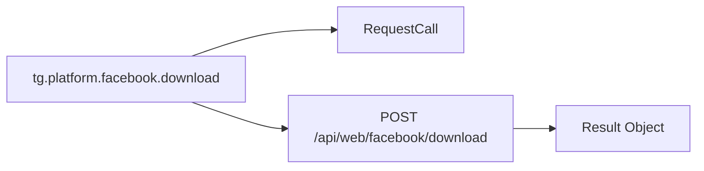

# Level architecture
Full documentation is available in [the docs](https://tgcore.ryzenths.dpdns.org/api/v2/docs).

Without explanation, the architecture may look confusing. ⊙⁠﹏⁠⊙



## Platform
parameters
- `url`
- tg.platform.`<method>`

```py
user = await tg.platform.facebook\
       .download()\
       .url()\
       .send(via_result=True)\

return user.video_url(0)
```

parameters
- `pinUrl`
```py

user = await tg.platform.pinterest\
       .download()
       .pinUrl("https://pinterest.com/pin/914862421155199/")
       .send(via_result=True)

return user.pins_urls()
```

parameters
- `platform`
- `url`
```py
user = await tg.platform.tools\
       .all_tools()
       .platform("instagram")
       .url("")
       .send()

return user
```

## Blackforest
* parameters
- `query`
```py
user = await tg.platform.blackforest\
      .image()\
      .query("HERE")\
      .send(via_result=True)\

return user.image_bytes()
```

## chatCompletions
* parameters
- `model`
- `messages`
- `stream`
```py
resp = await tg.raw.chatCompletions()\
    .model("kimi-dev")\
    .messages(
      [{"role": "user", "content": "say test"}]
    )\
    .stream(False)\
    .send(via_result=True)\

return resp.text()
```

## How to Automatically Save base_url?

You can set `base_url` when using the userbot:

1. **During initialization:**
`tg = Client(base_url="https://tgcore.ryzenths.dpdns.org")`
3. Or by assigning it directly:
`tg.base_url = "https://tgcore.ryzenths.dpdns.org"`

This value will be saved and persist.

Code Example:
```py
MEME_IG_URL = "https://www.instagram.com/reel/......"

result = await tg.use.default\
    .types("/api/web/platform/download")\
    .platform("instagram")\
    .url(MEME_IG_URL)\
    .send(allow_object=True)

return result
```

## JSON vs Fluent Builder: Key Differences

**JSON Approach:**
- Data is structured as a dictionary/object
- Static structure defined upfront
- Less flexible for conditional logic
- Example: `{"step": "this", "step2": "value"}`

**Fluent Builder Approach:**
- Chainable methods for dynamic construction
- More readable and expressive
- Easier to implement conditional steps
- Better IDE autocomplete support

**Your Example:**
```python
# JSON style
data = {"step": "this"}

# Fluent Builder style
result = await tg.use.default \
    .types("/") \
    .step() \
    .step2() \
    .step3() \
    .send()
```

**Key Advantage:** Fluent builder allows dynamic step-by-step construction while maintaining readability.
